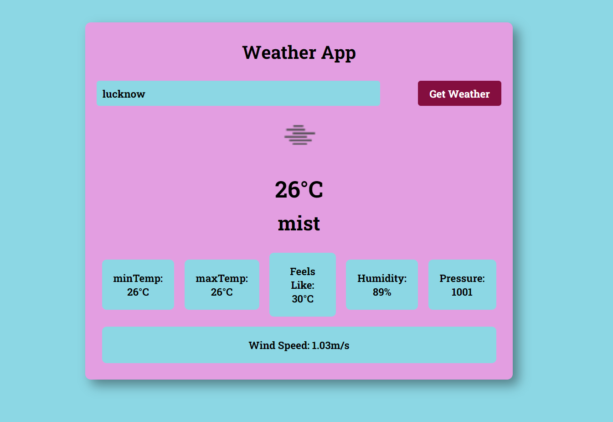
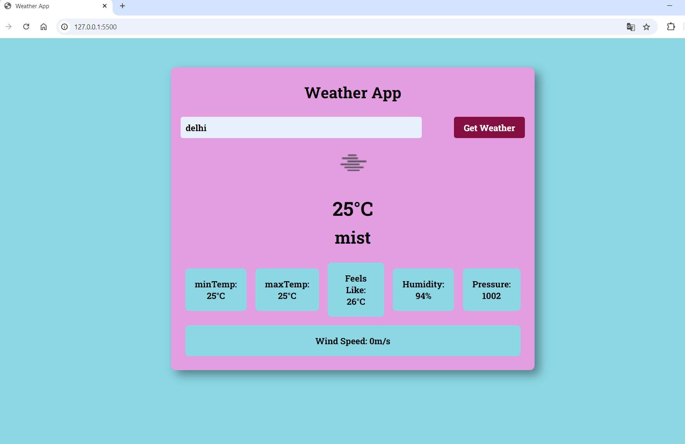
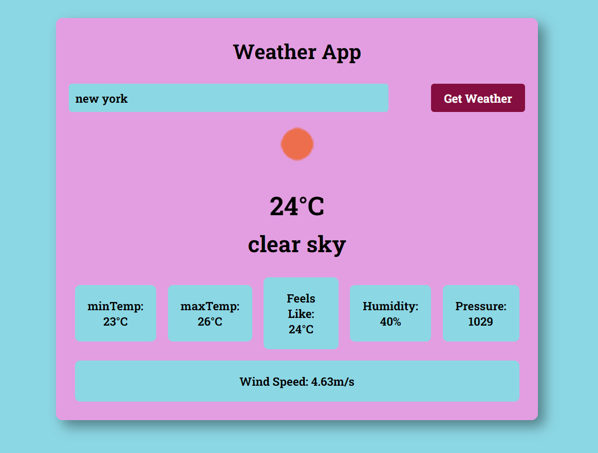

# Weather-App-using-HTML-CSS-and-JAVASCRIPT
[Click Here To Open!!](https://ananya-srivastava18.github.io/Weather-App-using-HTML-CSS-and-JAVASCRIPT/)
## Project Overview
The Weather App is a web application designed to provide real-time weather information for any city entered by the user. This project utilizes HTML, CSS, and JavaScript to create a user-friendly interface that fetches and displays weather data from the Open Weather Map API.

## Table of Contents
- Objective
- Technologies Used
- Features
- Usage
- Code Structure
- API Integration

## Objective
The primary goal of this project is to develop a simple yet effective weather forecasting website. Users can input the name of a city and receive detailed weather information, including temperature, humidity, pressure, and wind speed.

## Technologies Used
- **HTML**: Provides the structure of the web page.
- **CSS**: Applies styling to enhance the visual appeal of the web page.
- **JavaScript**: Implements functionality and integrates the Open Weather Map API.

## Features
- Real-time weather data retrieval from the Open Weather Map API.
- Displays comprehensive weather details such as temperature, humidity, pressure, and wind speed.
- Clean and intuitive user interface.

## Usage
1. Enter the name of the city in the input field.
2. Click the "Get Weather" button.
3. The application will display the current weather conditions for the entered city, including temperature, humidity, pressure, and wind speed.

## Code Structure
### HTML
The HTML file is structured into sections within a container. It includes an input field for the city name and a submit button to trigger the weather data retrieval.

### CSS
The CSS file provides basic styling to ensure a clean and user-friendly interface.

### JavaScript
- The API key is stored in a variable within the JavaScript file.
- The input from the HTML file is accessed using JavaScript variables.
- An event listener is added to the submit button to fetch and display the weather data.
- The fetched data is converted into JSON format for easy manipulation and display.

## API Integration
The application uses the Open Weather Map API to fetch weather data. Ensure you have an API key from Open Weather Map and replace `YOUR_API_KEY` in the JavaScript file with your actual API key.

# Here Are Some Previews

